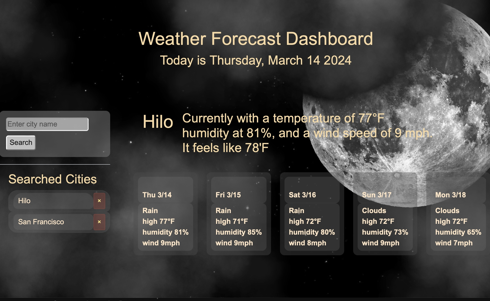

# Weather Dashboard
A weather forecast dashboard

## CHALLENGE GOAL:
Use the OpenWeather forecast API to create a site that shows selected city's current and future weather.

## RESOURCES & CREDITS:
- Class instruction and office hours
- Pertinent W3 sections on [web APIs](https://www.w3schools.com/js/js_api_intro.asp), [jquery](https://www.w3schools.com/jquery/default.asp)
- [Openweathermap API documentation](https://openweathermap.org/guide)
- Xpert AI Learning assistant
- Anatasia Goodwin, Pen code @agoodwin, [stars, clouds Background](https://codepen.io/agoodwin/pen/NMJoER)

## RELEVANT LINKS:
- [GitHub Repository](https://moonweatherdash.netlify.app)
- [Deployed Site](https://github.com/TreyLathe/WeatherDashboard)

## SCREENSHOTS:

## COMMENTS:
- First developed as a challenge for a full stack bootcamp. Further developed for better UI.
- API will search most cities, currently doesn't correct or autofill.

## FUTURE DEVELOPMENT
- create a different background that changes based on daylight/nightime hours.
- create different backgrounds depending on current weather, sun, 
clouds, rain, snow.. for day and night
- improve search functionality to correct and autofill